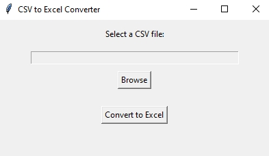
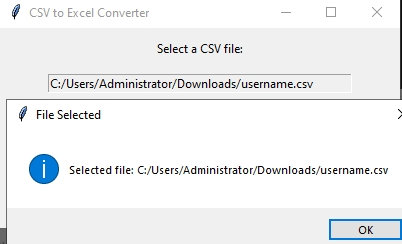

# CSV to Excel Converter

A lightweight desktop tool for converting CSV files into Excel format. Its clean interface ensures a hassle-free conversion process.

## Features

- **Select CSV File**: Browse and select the CSV file you want to convert.
- **Convert to Excel**: Converts the CSV file into an Excel `.xlsx` file with just one click.
- **Save File**: Save the converted Excel file to your preferred location.

## How to Use

1. Click the "Browse" button to select a CSV file.
2. Click "Convert to Excel" to process the file.
3. Choose a location to save the resulting Excel file.

## Screenshots

### Main

### File Selection
